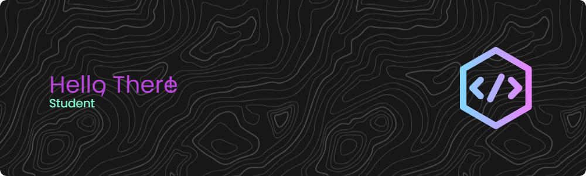

  
  <h1> Olá 👋! Sou o Miguel</h1>
  <h4> Um ainda padawan em programação</h3>

  
 -  Adoro passar meu tempo livre quebrando a cabeça em codigos ❤

  
 -  Atualmente estou na faculdade e fazendo uns projetos

  
 - Amo gatos 🐈

<h4>Linguagens e ferramentas</h4>

 
  
  
  
  
  
  
  
  
  
  
  
   
  

  

&nbsp;

<picture>
  <source media="(prefers-color-scheme: dark)" srcset="https://raw.githubusercontent.com/migsv/migsv/output/github-contribution-grid-snake-dark.svg">
  <source media="(prefers-color-scheme: light)" srcset="https://raw.githubusercontent.com/migsv/migsv/output/github-contribution-grid-snake.svg">
  
</picture>
